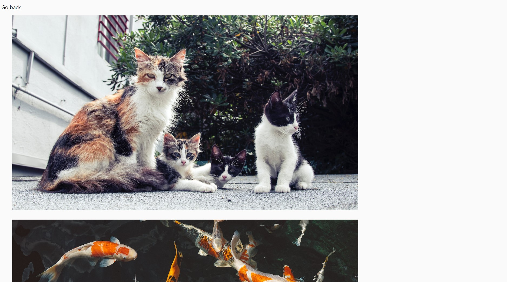
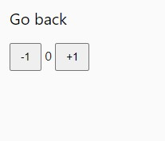
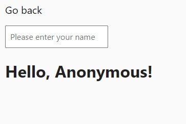
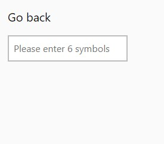
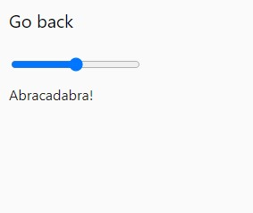
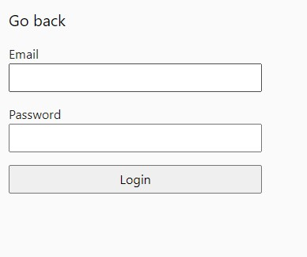
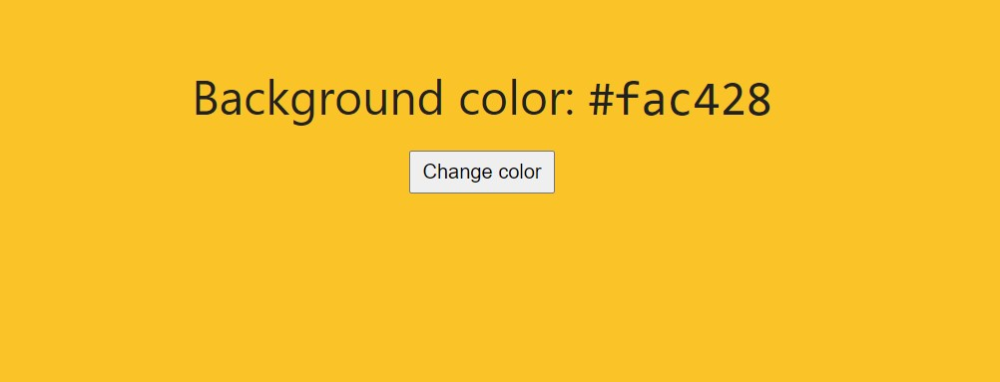

# Javascript dom and events.

## Task №1

### A script has been written that:

#### 1. Counts and prints to the console the number of categories in `ul#categories`, i.e. `li.item` elements.

#### 2. For each `li.item` element in the `ul#categories` list, find and output to console element header text (`<h2>` tag) and the number of elements in category (all its nested `<li>`).

#### As a result, such messages will be displayed in the console.

```bash
Number of categories: 3

Category: Animals
Elements: 4

Category: Products
Elements: 3

Category: Technologies
Elements: 5
```

## Task №2

#### 1. There is an empty `ul#ingredients` list in HTML.

```html
<ul id="ingredients"></ul>
```

#### 2. JavaScript has an array of strings.

```js
const ingredients = [
  'Potatoes',
  'Mushrooms',
  'Garlic',
  'Tomatos',
  'Herbs',
  'Condiments',
];
```

#### 3. A script is written for each element of the `ingredients` array:

#### 4. Create a separate `<li>` element.

#### 5. Add the name of the ingredient as its text content.

#### 6. Add the `item` class to the element.

#### 7. Then it will insert all `<li>` in one operation into the `ul.ingredients` list.

## Task №3

#### 1. A script created an image gallery based on a data array. The HTML has list `ul.gallery`.

```html
<ul class="gallery"></ul>
```

#### 2. An array of `images` objects is used to create `` elements nested in `<li>`. Template strings and the method are used to create markup. `insertAdjacentHTML()`.

#### - All gallery elements must be added to the DOM in a single paste operation.

#### - Added minimal gallery design.

```js
const images = [
  {
    url: 'https://images.pexels.com/photos/140134/pexels-photo-140134.jpeg?dpr=2&h=750&w=1260',
    alt: 'White and Black Long Fur Cat',
  },
  {
    url: 'https://images.pexels.com/photos/213399/pexels-photo-213399.jpeg?dpr=2&h=750&w=1260',
    alt: 'Orange and White Koi Fish Near Yellow Koi Fish',
  },
  {
    url: 'https://images.pexels.com/photos/219943/pexels-photo-219943.jpeg?dpr=2&h=750&w=1260',
    alt: 'Group of Horses Running',
  },
];
```



## Task №4

#### 1. The counter consists of a span and buttons that, when clicked, increase and decrease its value by one.

```html
<div id="counter">
  <button type="button" data-action="decrement">-1</button>
  <span id="value">0</span>
  <button type="button" data-action="increment">+1</button>
</div>
```

#### - Created a variable `counterValue` which will store the current value of the counter and initialize it with the value `0`.

#### - Added listeners for button clicks, inside which you can increase or decrease the counter value.

#### - The interface is updated with the new value of the `counterValue` variable.



## Task №5

#### 1. A script has been written that, when typing text in the `input#name-input` input (`input` event), substitutes its current value in `span#name-output`. If the input is empty, the #### span should display the string `"Anonymous"`.

```html
<input type="text" id="name-input" placeholder="Please enter your name" />
<h1>Hello, <span id="name-output">Anonymous</span>!</h1>
```



## Task №6

#### 1. A script has been written that checks its contents for the correct number of entered characters when the focus is lost on an input (the `blur` event).

```html
<input
  type="text"
  id="validation-input"
  data-length="6"
  placeholder="Please enter 6 symbols"
/>
```

#### - How many characters should be in the input is specified in its `data-length` attribute.

#### - If the correct number of characters is entered, the `border` of the input becomes green, if the wrong number is red.



## Task №7

#### 1. A script was written that responds to a change in the value of `input#font-size-control` (the `input` event) and changes the inline style of `span#text` by updating the property `font-size`. As a result, when you drag the slider, the text size will change.

```html
<input id="font-size-control" type="range" min="16" max="96" />
<br />
<span id="text">Abracadabra!</span>
```



## Task №8

#### The login form control script has been written.

```html
<form class="login-form">
  <label>
    Email
    <input type="email" name="email" />
  </label>
  <label>
    Password
    <input type="password" name="password" />
  </label>
  <button type="submit">Login</button>
</form>
```

#### 1. Handling the submission of the `form.login-form` form must be on the `submit` event.

#### 2. When submitting the form, the page should not be reloaded.

#### 3. If the form has blank fields, print an `alert` warning that all fields must be filled.

#### 4. If the user has filled in all the fields and submitted the form, collect the field values into an object where the field name will be the property name and the field value will be the property value.

#### 5. Displays the object with the entered data in the console and clear the values of the form fields using the `reset` method.



## Task №9

#### 1. A script has been written that changes the background colors of the `<body>` element via inline style when clicking on `button.change-color` and displays the color value in `span.color`.

```html
<div class="widget">
  <p>Background color: <span class="color">-</span></p>
  <button type="button" class="change-color">Change color</button>
</div>
```

#### 2. The `getRandomHexColor` function is used to generate a random color.

```js
function getRandomHexColor() {
  return `#${Math.floor(Math.random() * 16777215).toString(16)}`;
}
```


